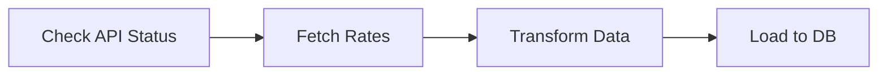

Here is a professional and comprehensive `README.md` template for your Airflow ETL project.

I have structured it to cover the standard software engineering practices: **Setup, Architecture, Configuration, and Usage**.

-----

# Currency Exchange Rate ETL Pipeline 💱

## 📖 Overview

This project is an automated ETL (Extract, Transform, Load) pipeline built with **Apache Airflow**. It orchestrates the daily ingestion of currency exchange rates, transforms the data for analysis, and loads it into a target data warehouse.

**Key Features:**

  * **Extract:** Fetches real-time/historical exchange rates from [ExchangeRate-API](https://www.exchangerate-api.com/) (or similar provider).
  * **Transform:** Cleanses data, calculates volatility, and formats timestamps using **Pandas**.
  * **Load:** Upserts data into a **PostgreSQL** database (or S3/BigQuery).
  * **Alerting:** Slack/Email notifications on pipeline failure.

-----

## 🏗️ Architecture

The pipeline follows a standard DAG (Directed Acyclic Graph) structure:

1.  **Is\_API\_Available:** Checks if the external API endpoint is responsive (HttpSensor).
2.  **Fetch\_Exchange\_Rates:** PythonOperator that hits the API and pulls JSON data.
3.  **Process\_Data:** Pandas transformation to flatten JSON and convert types.
4.  **Load\_Data:** Inserts cleaned records into the database.

<!-- end list -->



-----

## 🛠️ Tech Stack

  * **Orchestration:** Apache Airflow
  * **Language:** Python 3.9+
  * **Data Processing:** Pandas
  * **Containerization:** Docker & Docker Compose
  * **Database:** PostgreSQL
  * **API:** ExchangeRate-API / Open Exchange Rates

-----

## 🚀 Getting Started

### Prerequisites

  * Docker Desktop installed.
  * An API Key from a currency provider (e.g., [ExchangeRate-API](https://www.exchangerate-api.com/)).

### Installation

1.  **Clone the repository**

    ```bash
    git clone https://github.com/your-username/airflow-currency-etl.git
    cd airflow-currency-etl
    ```

2.  **Set up Environment Variables**
    Create a `.env` file in the root directory to store secrets.

    ```bash
    cp .env.example .env
    ```

    *Edit `.env` and add your API key and DB credentials:*

    ```ini
    AIRFLOW_UID=50000
    CURRENCY_API_KEY=your_api_key_here
    POSTGRES_USER=airflow
    POSTGRES_PASSWORD=airflow
    POSTGRES_DB=airflow
    ```

3.  **Build and Run with Docker**
    Initialize the Airflow database and start services.

    ```bash
    docker-compose up airflow-init
    docker-compose up -d
    ```

4.  **Access the UI**

      * Go to `http://localhost:8080`
      * **Username:** `airflow`
      * **Password:** `airflow`

-----

## 📂 Project Structure

```text
.
├── dags/
│   └── currency_etl_dag.py     # Main DAG definition
├── plugins/
│   └── helpers/                # Custom hooks or operators
├── scripts/
│   ├── extract.py              # API calling logic
│   └── transform.py            # Pandas transformation logic
├── sql/
│   └── create_table.sql        # DDL for database schema
├── docker-compose.yaml         # Airflow container config
├── requirements.txt            # Python dependencies
└── README.md
```

-----

## ⚙️ Configuration & Usage

### 1\. Connections

Before running the DAG, ensure the Database connection is set in Airflow.

  * Go to **Admin -\> Connections**.
  * Add a new connection ID: `postgres_default`.
  * Fill in host, login, and password from your docker-compose configuration.

### 2\. Running the DAG

1.  Trigger the `currency_exchange_etl` DAG manually to test.
2.  Check the **Grid View** to ensure all tasks turn green (Success).
3.  Verify data in the database:
    ```sql
    SELECT * FROM exchange_rates WHERE base_currency = 'USD' LIMIT 5;
    ```

-----

## 🤝 Contributing

1.  Fork the project
2.  Create your feature branch (`git checkout -b feature/AmazingFeature`)
3.  Commit your changes (`git commit -m 'Add some AmazingFeature'`)
4.  Push to the branch (`git push origin feature/AmazingFeature`)
5.  Open a Pull Request

## 📄 License

Distributed under the MIT License. See `LICENSE` for more information.
